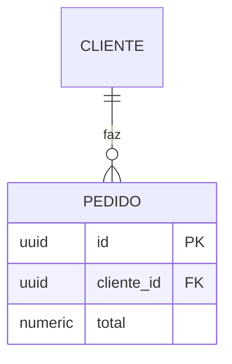

# Banco de dados no fluxo SDD

## Onde cada coisa vive

| Arquivo | O que tem | Quem escreve |
|---|---|---|
| `.claude/specs/schema.md` | Schema **completo e atual**. Fonte única da verdade. | Engineer, na WP da migração |
| `plan.md` da feature | Apenas o **delta** da feature | Spec Architect |
| `spec.md` da feature | Regras de negócio em português, sem tabelas | Spec Architect |

Nunca copie o schema completo para dentro de uma feature. Na décima feature você teria dez cópias divergentes do mesmo banco.

## Quando incluir a seção "Banco de dados" no plan

**Inclua se a feature:** cria tabela, adiciona/remove coluna, muda tipo de coluna, cria/altera relação (FK), ou adiciona índice.

**Não inclua se:** a feature só lê dados existentes. Escreva uma linha: *"Não altera o banco. Schema atual em `.claude/specs/schema.md`."*

## O que vai na spec (e o que não vai)

A spec traz a **regra**, não a estrutura. É aqui que erro de modelagem é pego, porque a pergunta é de negócio:

```
## O que o sistema precisa lembrar
- Um cliente pode ter vários pedidos
- Todo pedido tem um cliente — não existe pedido sem dono
- Se o cliente for excluído, os pedidos ficam (histórico fiscal)
```

"O que acontece com os pedidos se eu apagar o cliente" é decisão do dono do produto, não do desenvolvedor. Por isso vira pergunta fechada na seção de decisões, não uma escolha silenciosa de `ON DELETE`.

## Formato do diagrama

Mermaid `erDiagram`. Renderiza no VS Code e no GitHub, é texto (barato), e diffa bem no Git.



Cardinalidade: `||--o{` = um para muitos · `||--||` = um para um · `}o--o{` = muitos para muitos.

No delta do plan, inclua **apenas as tabelas envolvidas** — não as vizinhas "para dar contexto".

## Migração aditiva vs destrutiva

**Aditiva** — criar tabela, adicionar coluna nullable, criar índice. Nada existente quebra. Pode ir na mesma WP do código que a usa.

**Destrutiva** — remover coluna, renomear tabela ou coluna, mudar tipo, adicionar `NOT NULL` em coluna existente, adicionar unique em coluna com dados. Pode quebrar o que está em produção.

### Regra para migração destrutiva

Toda alteração destrutiva **exige WP própria**, separada de qualquer WP que mexa em código de feature. Essa WP declara:

1. **Estado atual** — quantas linhas, quais valores existem hoje na coluna afetada
2. **Passo de migração** — o comando, e se roda antes ou depois do deploy do código
3. **Como reverter** — o caminho de volta, e até quando ele existe
4. **Backup** — confirmação de que existe backup recente antes de rodar

Se a resposta a "como reverter" for "restaurar backup", isso precisa estar escrito. Não é aceitável descobrir na hora.

### Padrão seguro para renomear coluna

Rename direto quebra o código antigo durante o deploy. Faça em três WPs:

1. Adicionar a coluna nova, escrever nas duas (aditiva)
2. Migrar os dados e apontar as leituras para a nova
3. Remover a coluna antiga (destrutiva) — só depois que 2 estiver em produção e estável

## Checklist antes de aprovar uma WP de banco (Review Agent)

- [ ] `schema.md` foi atualizado no mesmo commit da migração
- [ ] O `atualizado_em` do frontmatter do `schema.md` mudou
- [ ] A linha entrou no "Histórico de migrações"
- [ ] Se destrutiva: WP separada, com reversão escrita e backup confirmado
- [ ] As regras de integridade novas estão descritas em português, não só em SQL
