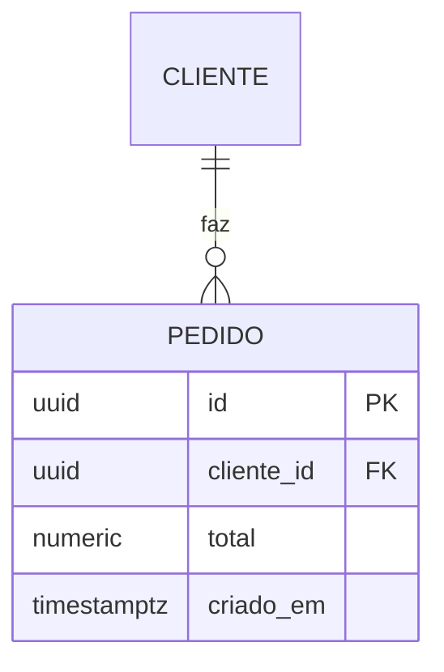
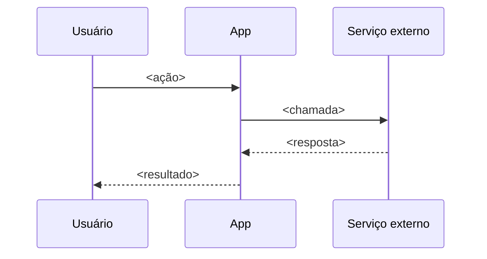
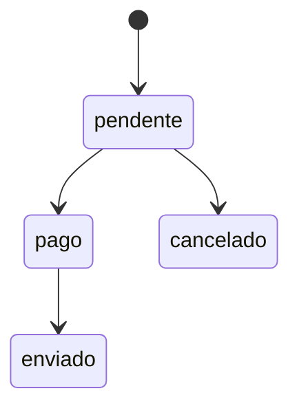

# Plano — <nome da feature>

## Abordagem

<2–4 parágrafos de estratégia técnica. Aqui o jargão é permitido e esperado.>

## Decisões técnicas

| Decisão | Escolha | Alternativas | Por quê |
|---|---|---|---|
| <o que precisava ser decidido> | <o que foi escolhido> | <o que foi descartado> | <razão> |

## Arquivos

**Criados**
- `caminho/novo.ext` — <propósito>

**Modificados**
- `caminho/existente.ext` — <que mudança>

**Explicitamente não tocados**
- `caminho/tentador.ext` — <por que fica fora>

## Banco de dados

<!-- INCLUA ESTA SEÇÃO APENAS SE a feature cria tabela, adiciona/remove coluna
     ou muda relação. Caso contrário, apague a seção inteira e escreva:
     "Não altera o banco. Schema atual em `.claude/specs/schema.md`."
     Mostre SÓ o delta — nunca o schema completo. Regras em references/database.md. -->

**Delta deste plano:**

- **Nova tabela `pedido`** — <o que guarda>
- **`pedido.cliente_id` → `cliente.id`**, `ON DELETE RESTRICT` — <regra de negócio que justifica>
- **Índice** em `<coluna>` — <consulta que justifica>

**Migração:** <aditiva | destrutiva>
<!-- Destrutiva (drop/rename de coluna, mudança de tipo com dado em produção)
     exige WP própria, separada de código de feature. Ver references/database.md. -->

**Atualizar `.claude/specs/schema.md`** na mesma WP que aplica a migração.

## Fluxo principal

<!-- Opcional. Use quando a feature envolve sistema externo ou tem mais de 4 passos. -->

## Estados

<!-- Opcional. Use quando a feature tem campo de status. -->

## Riscos

| Risco | Mitigação |
|---|---|
| <o que pode dar errado> | <como reduzir> |

## Testes

<Estratégia. O que é automatizado, o que é verificado à mão.>

## Fora de escopo técnico

- <refatoração adjacente que fica para depois>

<!-- Seções opcionais — inclua apenas se houver algo real a dizer, nunca
     como parágrafo genérico: performance, acessibilidade, segurança, i18n, rollout. -->
