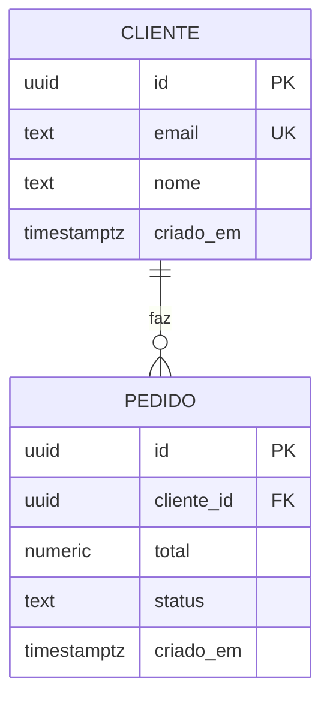

# Banco de dados

Fonte única da verdade do schema. Toda WP que altera o banco atualiza este
arquivo no mesmo commit da migração.

O `plan.md` de cada feature mostra apenas o **delta** — nunca uma cópia deste
arquivo.

## Diagrama

## Regras de integridade

<!-- Em português. É o que permite conferir o modelo sem ler SQL. -->

- **`pedido.cliente_id` → `cliente.id`**, `ON DELETE RESTRICT` — pedido é histórico fiscal, não some quando o cliente é excluído.
- **`cliente.email` é único** — mesma pessoa não cria duas contas com o mesmo e-mail.

## Histórico de migrações

| Data | Feature | Mudança | Tipo |
|---|---|---|---|
| AAAA-MM-DD | 001-slug | criou `pedido` | aditiva |
