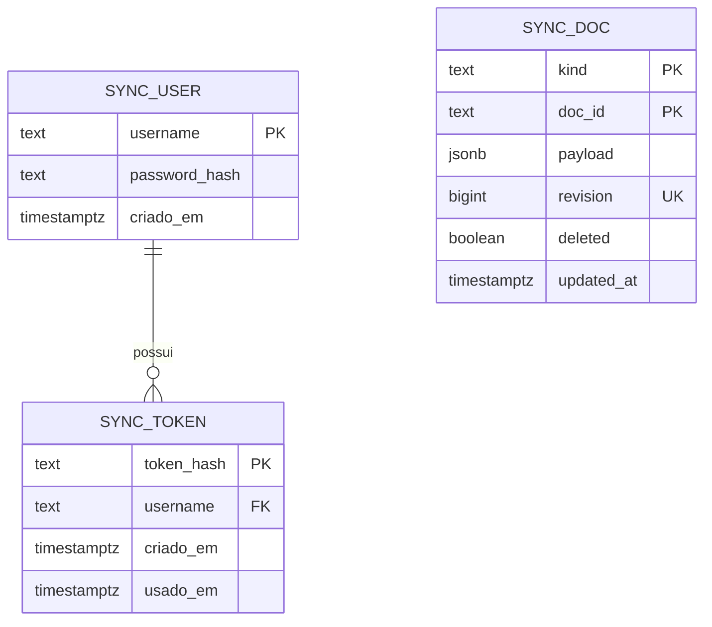
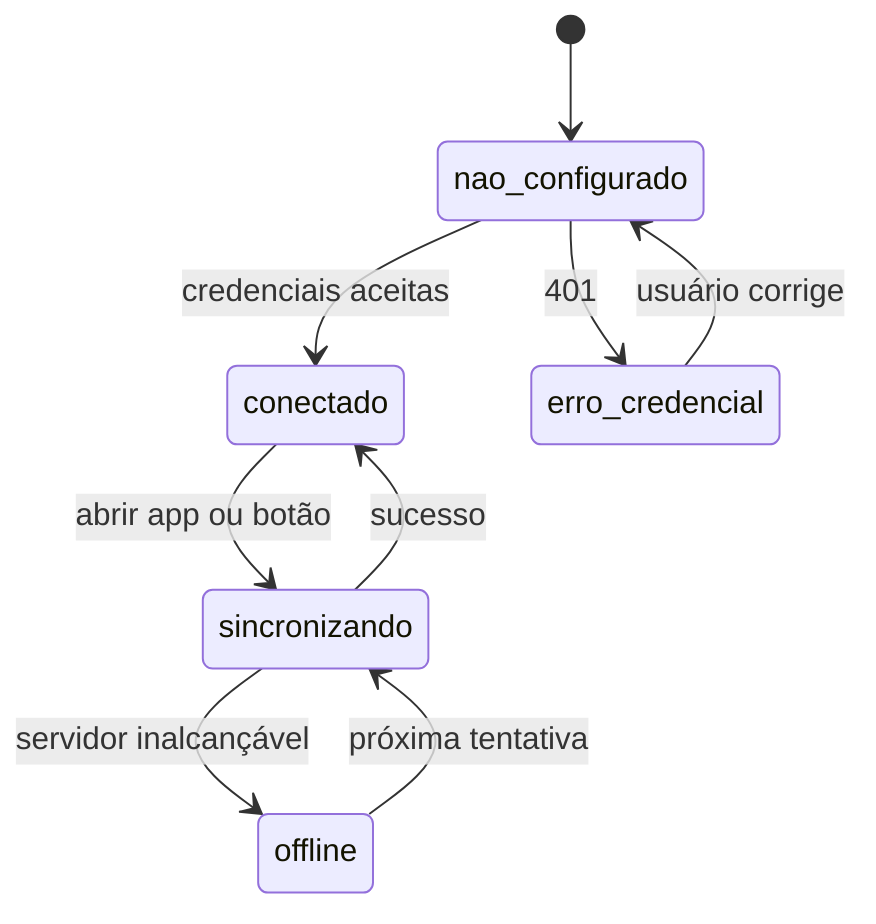

# Plano — Sincronizar as tarefas entre meus dispositivos

## Abordagem

**Servidor burro, cliente inteligente.** O n8n expõe três webhooks — `auth`, `pull`, `push` — sobre uma única tabela chave-valor no Postgres. Ele não conhece o formato de uma tarefa, não resolve conflito e não valida regra de negócio: guarda documentos JSON opacos, versionados por um contador global monotônico. Toda a inteligência fica em JavaScript no repositório, onde é lida, revisada e versionada junto com o resto do app. Lógica de negócio dentro de nós do n8n seria invisível ao Git e impossível de revisar.

**Detecção de mudança por snapshot, não por instrumentação.** O caminho óbvio — carimbar `updatedAt` em cada mutation — exigiria tocar as ~15 mutations de `todolist.store.js` e todos os pontos que criam tarefa, num código legado de dois anos. Em vez disso, o cliente guarda no IndexedDB um **snapshot da última versão sincronizada** (`sync_base`). Comparando `base` (última sincronização) × `local` (agora) × `remote` (servidor), obtemos uma **fusão de três vias** que deriva sozinha o que foi criado, alterado e apagado de cada lado. Nenhuma mutation existente muda. O único campo novo obrigatório na tarefa é `id`, que dá identidade estável onde hoje só existe posição no array.

**Fusão campo a campo, não documento a documento.** Duas tarefas com o mesmo `id` alteradas nos dois lados são resolvidas por campo: se um dispositivo marcou a caixa e o outro editou a descrição, as duas mudanças sobrevivem. Só quando **o mesmo campo** muda dos dois lados é que existe conflito real, resolvido pelo carimbo `updatedAt` — carimbado no momento em que a sincronização detecta a mudança local, não no momento do clique. É uma imprecisão consciente: fica registrada nos riscos, e o desempate final é determinístico por `deviceId` para nunca haver divergência entre dispositivos. **Apagado versus alterado sempre preserva a alteração** — a feature existe para acabar com a dúvida de "sumiu alguma coisa?".

**Ordem de construção com o PWA na frente.** Web-first sem service worker é regressão frente ao Electron de hoje: sem rede, o app nem carrega. Por isso WP01 entrega PWA e armazenamento persistente antes de qualquer linha de sincronização — e é a única WP que já melhora a vida sozinha, mesmo que o resto atrase.

## Decisões técnicas

| Decisão | Escolha | Alternativas | Por quê |
|---|---|---|---|
| Onde resolve conflito | Cliente, em JS no repositório | Nós de código no n8n; extensão Postgres | Versionado, revisável, testável fora do n8n |
| Detectar mudança local | Snapshot `sync_base` + diff de três vias | `updatedAt` em toda mutation; oplog/CRDT | Zero mudança nas mutations existentes; CRDT é desproporcional para um usuário |
| Identidade da tarefa | Campo `id` com `crypto.randomUUID()` | Índice no array; hash do conteúdo | Sem dependência nova; índice quebra ao reordenar |
| Granularidade da fusão | Campo a campo dentro da tarefa | Tarefa inteira por LWW | Marcar feito num lado e editar texto no outro não deve perder nada |
| Apagado × alterado | Alteração vence, tarefa ressuscita | Apagado vence | Perder tarefa é o pior desfecho possível para esta feature |
| Protocolo | Pull-merge-push com `baseRevision` por documento | Push cego com LWW no servidor | Rejeita escrita sobre versão obsoleta; sem perda silenciosa entre pull e push |
| Formato no servidor | Uma tabela `sync_doc`, JSONB opaco | Tabelas normalizadas de tarefa/subtarefa | Servidor não precisa entender o formato; mudanças de modelo não pedem migração no servidor |
| Senha | `pgcrypto` (`crypt`/`gen_salt('bf')`) no Postgres | Hash em nó de código do n8n | Tira criptografia do n8n; `crypt()` compara em tempo constante |
| Token | Aleatório de 32 bytes, guardado como SHA-256 | JWT; sessão com expiração | Um usuário, sem expiração por decisão da spec; vazamento do banco não expõe token utilizável |
| `repeating_events_by_date` | Sincroniza | Deixar local por ser cache | Dois dispositivos materializariam a mesma recorrência e duplicariam a tarefa |
| Cliente HTTP | `axios`, já no `package.json` | `fetch` puro | Dependência existente, interceptador de erro num lugar só |
| PWA | `@vue/cli-plugin-pwa@^4` | Service worker escrito à mão | Casa com vue-cli 4 / webpack 4; `^5` exige vue-cli 5 |

## Arquivos

**Criados**

- `src/helpers/syncMerge.js` — fusão de três vias, funções puras, sem I/O. Coração da feature.
- `src/helpers/syncEngine.js` — orquestra o ciclo: pull → merge → gravar local → push → atualizar `sync_base`.
- `src/repositories/syncRepository.js` — object store `sync_base` e metadados de sincronização no IndexedDB.
- `src/repositories/syncApi.js` — chamadas HTTP aos três webhooks, com o token no header.
- `src/store/modules/sync.store.js` — estado de conexão, última sincronização, erro corrente.
- `src/components/config/syncSettings.vue` — aba de sincronização das configurações.
- `src/migrations/dataMigrations.js` — migração de dados do IndexedDB (hoje só existe migração de config).
- `src/registerServiceWorker.js` — gerado pelo plugin PWA.
- `server/schema.sql` — tabelas, índices e criação do usuário.
- `server/docker-compose.postgres.yml` — trecho do serviço Postgres para acrescentar ao compose do n8n.
- `server/n8n/auth.json`, `server/n8n/pull.json`, `server/n8n/push.json` — workflows exportados, versionados.
- `.claude/docs/servidor-sync.md` — passo a passo do servidor, executável pelo usuário.
- `.claude/docs/publicar-web.md` — passo a passo do Cloudflare Pages.

**Modificados**

- `src/repositories/dbRepository.js` — versão 4 → 5, novo object store `sync_base`; envolver as operações em `Promise` para que a sincronização possa esperar a escrita terminar.
- `src/migrations/migrations.js` — chamar `dataMigrations` e registrar as chaves novas de config.
- `src/repositories/configRepository.js` — defaults novos: `syncUrl`, `syncUser`, `syncToken`, `deviceId`, `lastSyncAt`.
- `src/App.vue` — disparar a migração de dados e o pull de abertura; recarregar as listas visíveis quando a sincronização trouxer mudança.
- `src/store/store.js` — registrar `sync.store`.
- `src/views/configModal.vue` — nova aba apontando para `syncSettings.vue`.
- `src/views/configList.js` — item de menu da aba.
- `src/components/toDoList.vue`, `src/views/toDoModal/toDoModal.vue`, `src/helpers/repeatingEvents.js`, `src/helpers/initialDataCreator.js` — atribuir `id` na criação da tarefa (os 5 pontos de `addTodo`/`insertTodo` mapeados).
- `src/helpers/exportTool.js` — preservar `id` na exportação e gerar `id` na importação de arquivo antigo.
- `src/assets/languages/*.js` (19 arquivos) — chaves da aba de sincronização.
- `package.json`, `vue.config.js` — plugin PWA e `manifest` do build web.
- `public/index.html` — remover o registro comentado de service worker (linha 46), substituído pelo plugin.

**Explicitamente não tocados**

- `src/store/modules/todolist.store.js` — nenhuma mutation muda. É o ponto inteiro da abordagem por snapshot; se este arquivo aparecer no diff, a estratégia foi abandonada sem discussão.
- `src/background.js` e o build Electron — continuam como estão; a sincronização roda no renderer, igual à web.
- `netlify.toml` — resquício do upstream, sem efeito no Cloudflare Pages. Fica para o INBOX.
- `src/main.js` (bloco Sentry) — a chave só liga por variável de ambiente; não configurar no Cloudflare Pages mantém desligado.

## Banco de dados

Primeiro banco relacional do projeto. `.claude/specs/schema.md` passa a existir com o IndexedDB atual e as tabelas abaixo.

**Delta deste plano:**



- **`sync_doc`** — um documento por lista de tarefas, recorrência, cache de recorrência por data, lista de listas personalizadas e configuração. Chave primária composta `(kind, doc_id)`; `kind` separa os espaços de nome, já que uma lista personalizada pode se chamar `20260902`.
- **`sync_doc.revision`** — `DEFAULT nextval('sync_revision_seq')`, reatribuído a cada escrita. É o relógio lógico do servidor: `pull` pede tudo com `revision > $since`. Índice em `revision`.
- **`sync_doc.deleted`** — lápide. Documento apagado vira linha com `deleted = true`, senão volta do outro dispositivo. Limpeza de lápides com mais de 90 dias na rotina de manutenção.
- **`sync_token.username` → `sync_user.username`**, `ON DELETE CASCADE` — apagar o usuário invalida os tokens dele.
- **Extensão `pgcrypto`** — `crypt()` e `gen_salt('bf')` para a senha.

**Migração:** aditiva no Postgres (banco novo).

No IndexedDB há **duas** migrações, ambas aditivas e idempotentes, na WP03: subir a versão do banco de 4 para 5 criando `sync_base`, e percorrer `todo_lists` atribuindo `id` a toda tarefa que ainda não tem. Nenhum campo é removido ou renomeado; instalação antiga continua abrindo.

**Atualizar `.claude/specs/schema.md`** na WP02 (Postgres) e na WP03 (IndexedDB).

## Fluxo principal

```mermaid
sequenceDiagram
    participant U as Usuário
    participant A as App (navegador)
    participant N as n8n
    participant P as Postgres

    U->>A: abre o app ou clica em sincronizar
    A->>N: POST /pull { since: ultimaRevisao }
    N->>P: SELECT WHERE revision > since
    P-->>N: documentos alterados
    N-->>A: { revision, docs[] }
    A->>A: fusão de três vias (base × local × remoto)
    A->>A: grava o resultado no IndexedDB
    A->>N: POST /push { docs[], baseRevision por documento }
    N->>P: UPDATE se revision = baseRevision
    P-->>N: aceitos e rejeitados
    N-->>A: { revision, rejeitados[] }
    A->>A: atualiza sync_base; se houve rejeitado, repete o ciclo
    A-->>U: "sincronizado às HH:MM" ou erro claro
```

## Estados



`offline` nunca bloqueia a interface: o app segue gravando local e mostra a pendência na aba de sincronização.

## Riscos

| Risco | Mitigação |
|---|---|
| `updatedAt` carimbado na detecção, não no clique — dispositivo que editou antes mas sincronizou depois pode vencer | Só afeta o mesmo campo da mesma tarefa alterado nos dois lados entre duas sincronizações. Fusão campo a campo reduz a janela; desempate por `deviceId` garante que os dois dispositivos chegam ao mesmo resultado, nunca a resultados divergentes |
| Escrita fire-and-forget no `dbRepository` — sincronizar pode ler estado ainda não gravado | WP04 envolve as operações em `Promise`; `syncEngine` só monta o payload depois que a gravação resolve |
| Ordem das tarefas dentro da lista não tem resolução perfeita | Ordem local vence; tarefas que só existem no remoto entram no fim preservando a ordem relativa delas. Documentado como comportamento, não como bug |
| Navegador descarta o IndexedDB e o dispositivo repropaga estado vazio | `sync_base` some junto; sem base, a fusão trata tudo do servidor como criação remota e nada é apagado. Somado a `storage.persist()` na WP01 |
| Build no Cloudflare Pages com Node ≥ 17 quebra (`ERR_OSSL_EVP_UNSUPPORTED`) | Fixar `NODE_VERSION=16` e `NODE_OPTIONS=--openssl-legacy-provider` nas variáveis do projeto; registrado em `.claude/docs/publicar-web.md` |
| CORS liberado demais expõe o webhook a qualquer site | Origem única e explícita nos workflows, nunca `*`; o `netlify.toml` com `*` do upstream não vale para o Cloudflare Pages |
| Segredo em `localStorage` num app com `nodeIntegration: true` no Electron | Superfície inalterada em relação a hoje; o app não renderiza conteúdo remoto. Registrado no INBOX, fora do escopo desta feature |
| Workflows do n8n editados na interface divergem do JSON do repositório | `.claude/docs/servidor-sync.md` instrui a reexportar e commitar após qualquer edição |

## Testes

Não há infraestrutura de teste (`yarn test` é `echo success`) e criá-la é decisão de projeto, não desta feature. Duas exceções onde o custo se paga:

- **`syncMerge.js` ganha testes de verdade.** É lógica pura, sem I/O, e é onde um erro apaga dados do usuário. A WP05 entrega os casos junto com o código, executáveis por `node` puro, sem framework: criação dos dois lados, alteração do mesmo campo dos dois lados, alteração de campos diferentes, apagado × alterado, apagado dos dois lados, base ausente, tarefa sem `id` vinda de instalação antiga.
- **Roteiro manual de dois dispositivos** em `.claude/docs/servidor-sync.md`, cobrindo item a item o "Está pronto quando" da spec, incluindo o ciclo com modo avião.

O resto é validação manual, como no resto do projeto: rodar, exercitar, `yarn run lint`.

## Fora de escopo técnico

- Reescrever `dbRepository` com uma biblioteca de IndexedDB — a WP04 envolve em `Promise` só o que a sincronização precisa.
- Extrair as abas existentes de `configModal.vue` (520 linhas) para componentes — só a aba nova nasce separada.
- Corrigir `<sponsor-modal>` / `<collaborators-modal>` em `aboutModal.vue` — INBOX.
- Remover `netlify.toml` e as dependências mortas do upstream — INBOX.
- Backup automático do Postgres além do comando documentado.
