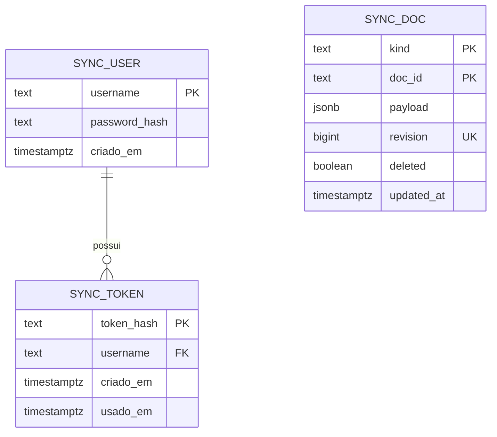

# Schema — WeekToDo Journal

Fonte única da verdade sobre persistência. Cada `plan.md` de feature mostra
apenas o delta; o desenho completo vive aqui.

O projeto tem três camadas de persistência, todas descritas abaixo:

| Camada | Onde roda | O que guarda |
|---|---|---|
| `localStorage` | navegador / renderer do Electron | configuração e lista de listas personalizadas |
| IndexedDB `weekToDo` | navegador / renderer do Electron | tarefas, recorrências e snapshot de sincronização |
| Postgres | servidor do usuário, atrás do n8n | documentos sincronizados entre dispositivos |

---

## localStorage

Acessado somente por `src/repositories/storageRepository.js`.

| Chave | Formato | Origem do default |
|---|---|---|
| `config` | objeto com ~36 preferências | `configRepository.load()` |
| `customTodoListIds` | `[{ listId, listName }]` | `customToDoListIdsRepository.load()` |

Chaves de `config` relacionadas à sincronização (nunca são sincronizadas, nunca
entram em documento enviado ao servidor):

| Chave | Default | Papel |
|---|---|---|
| `syncUrl` | `null` | base dos três webhooks do n8n |
| `syncUser` | `null` | usuário cadastrado em `sync_user` |
| `syncToken` | `null` | token devolvido pelo `auth` (a senha não é guardada) |
| `deviceId` | UUID gerado na primeira carga | desempate determinístico de conflito |
| `lastSyncAt` | `null` | ISO 8601 da última sincronização bem-sucedida |
| `lastSyncRevision` | `0` | maior `revision` já recebida do servidor |

Toda chave nova de `config` exige **duas** mudanças: o default em
`configRepository.load()` e uma função de migração em `src/migrations/migrations.js`.
Sem a segunda, quem já tem dados fica com a chave `undefined`.

---

## IndexedDB `weekToDo`

Versão atual: **5**. Acessado somente por `src/repositories/dbRepository.js`.

| Object store | Chave | Valor |
|---|---|---|
| `todo_lists` | id da lista (`YYYYMMDD` ou nome da lista personalizada) | array de tarefas |
| `repeating_events` | id da recorrência | `{ rrule, data }` — regra + molde da tarefa |
| `repeating_events_by_date` | id da lista (data) | `{ [idDaRecorrencia]: true }` |
| `sync_base` | `"<kind>::<docId>"` | `{ kind, docId, payload, revision, deleted }` |

### Tarefa

```js
{
  id,                 // UUID estável — desde a versão 5
  text, checked, listId, desc,
  subTaskList: [{ text, checked, editing }],
  color, priority, tags, time, alarm, repeatingEvent,
  updatedAt,          // carimbo da sincronização, só existe após o primeiro ciclo
  updatedBy           // deviceId que fez a última alteração vencedora
}
```

`updatedAt` e `updatedBy` são campos de controle: a fusão os ignora ao comparar
conteúdo e os usa apenas para desempatar conflito.

### `sync_base`

Snapshot da última versão sincronizada de cada documento. É o "base" da fusão de
três vias (base × local × remoto). Se este store for descartado pelo navegador, a
fusão trata tudo do servidor como criação remota — nada é apagado.

### Histórico de migrações

| Versão | Mudança | Onde |
|---|---|---|
| 4 | `todo_lists`, `repeating_events`, `repeating_events_by_date` | herdado do upstream |
| 5 | cria `sync_base`; atribui `id` a toda tarefa que ainda não tem | `dbRepository.open()` e `src/migrations/dataMigrations.js` |

Ambas as migrações da versão 5 são aditivas e idempotentes. Nenhum campo é
removido ou renomeado; instalação antiga continua abrindo.

---

## Postgres (servidor de sincronização)

Criado por `server/schema.sql`. Banco `weektodo`, separado do banco do n8n.
O servidor guarda documentos JSON opacos: ele não conhece o formato de uma
tarefa e não resolve conflito.



### `sync_doc`

| Coluna | Tipo | Papel |
|---|---|---|
| `kind` | `text` | espaço de nome do documento (ver tabela abaixo) |
| `doc_id` | `text` | id dentro do `kind` |
| `payload` | `jsonb` | conteúdo opaco para o servidor |
| `revision` | `bigint` | `nextval('sync_revision_seq')` a cada escrita; relógio lógico |
| `deleted` | `boolean` | lápide — apagar a linha faria o documento voltar |
| `updated_at` | `timestamptz` | usado só na limpeza de lápides |

Chave primária composta `(kind, doc_id)`, porque uma lista personalizada pode se
chamar `20260902` e colidir com um dia do calendário. Índice em `revision`, já
que o `pull` varre por revisão.

Valores de `kind` em uso:

| `kind` | `doc_id` | `payload` |
|---|---|---|
| `todo_lists` | id da lista | array de tarefas |
| `repeating_events` | id da recorrência | objeto da recorrência |
| `repeating_events_by_date` | id da lista (data) | `{ [idDaRecorrencia]: true }` |
| `custom_lists` | `all` | `[{ listId, listName }]` |
| `config` | `all` | subconjunto de `config` na lista branca do `syncEngine` |

### `sync_user` e `sync_token`

Senha com `pgcrypto` (`crypt` / `gen_salt('bf')`); a comparação acontece no
banco, em tempo constante. O token é aleatório de 32 bytes e o banco guarda
apenas o SHA-256 — vazamento da tabela não expõe token utilizável. Não há
expiração, por decisão da spec (um único usuário).
`sync_token.username → sync_user.username` com `ON DELETE CASCADE`.

### Histórico de migrações

| Data | Mudança | Onde |
|---|---|---|
| 2026-09-02 | criação de `pgcrypto`, `sync_revision_seq`, `sync_user`, `sync_token`, `sync_doc` e do índice em `revision` | `server/schema.sql` |
